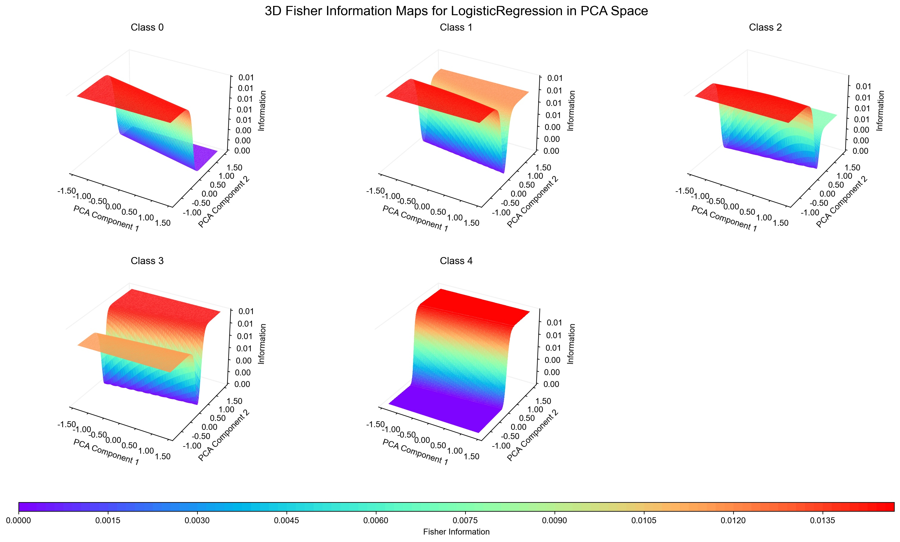
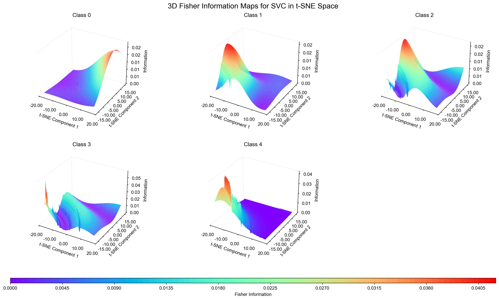
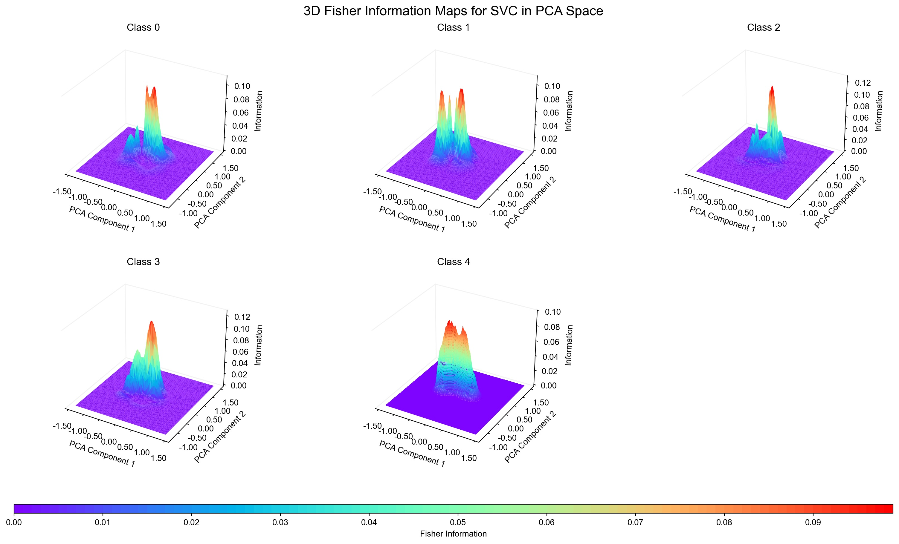
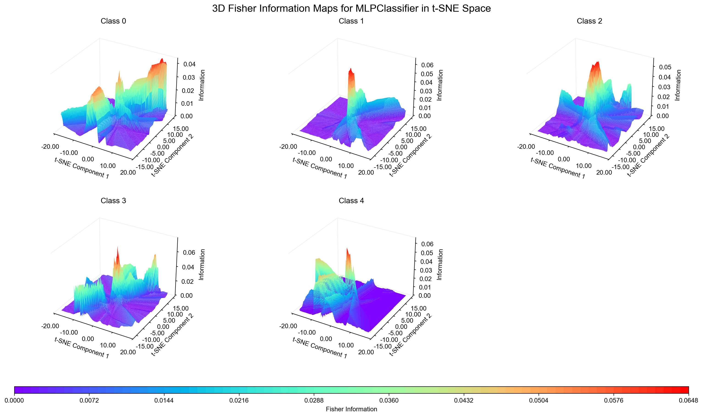

# Ordinal Classification

Author: [@deburky](https://github.com/deburky).

This notebook and attached scripts serve to track some experiments with simple ordinal classification approach (SOCA) proposed by Eibe Frank and Mark Hall.

I owe the discovery of this to @mosh98. You can find their implementation [here](https://github.com/mosh98/Ordinal_Classifier).

### Simple Ordinal Classification Approach

<table>
<tr>
<td></td>
<td>

The target we model each class as 1 if target > k, 0 otherwise. This results in several classifiers that are used in an ensemble manner. The first and last classifier are used as direct probability, and classes in-between are modeled as the difference between the probabilities of the next class.

For example we model the probability of class 1 out of 5 classes as:
- $1 - P(target > 1) = P(target <= 1)$

For the last class:
- $P(target > 4) = P(target = 5)$

The classes in between are modeled as:
- $P(target > k) - P(target > k+1)$

This way we can model the ordinal nature of the target variable.

**Reference:**
> Eibe Frank and Mark Hall. A Simple Approach to Ordinal Classification. Machine Learning: ECML 2001. Lecture Notes in Computer Science, vol 2167. Springer, Berlin, Heidelberg. [Link](https://link.springer.com/chapter/10.1007/3-540-44795-4_13)

</td>
</tr>
</table>

### Practical Example

The dataset used is [Amazon Fine Food Reviews](https://www.kaggle.com/datasets/snap/amazon-fine-food-reviews) with OpenAI embeddings ([repo](https://github.com/openai/openai-cookbook)), which are used as features (1536 embeddings per review) and use the score (1-5) as our target variable.

To test the approach we use:

- Logistic Regression
- SVM
- One-layer Neural Network

To illustrate how models fit the embedding space, we visualize Fisher information on a reduced embedding space using t-SNE/PCA.

The idea of ordinal classification is similar to proportional odds logistic regression model as described in Applied Logistic Regression (3rd ed.) by David W. Hosmer, Stanley Lemeshow, and Rodney X. Sturdivant.

Ordinal classification is a more generic approach, since we can use probabilistic classifiers other than logistic regression.

### Implementation

There are several ways to perform ordinal classification, most based on logistic regression methodologies.

The scikit-learn implementation or ordinal classifier comes from this [repo](https://github.com/mosh98/Ordinal_Classifier/tree/master), which implements the simple ordinal classification approach.

Additionally, `spacecutter` library by Ethan Rosenthal is tested for PyTorch models.

You can read more about the PyTorch approach [here](https://www.ethanrosenthal.com/2018/12/06/spacecutter-ordinal-regression/) as well as find the [repo](https://github.com/EthanRosenthal/spacecutter).

### Visualization

Below we visualize the embeddings using PCA and t-SNE, and the Fisher information of the embeddings.

#### Logistic Regression

##### t-SNE

##### PCA

#### Support Vector Machine (SVM)

##### t-SNE

##### PCA

#### Neural Network

##### t-SNE

##### PCA

